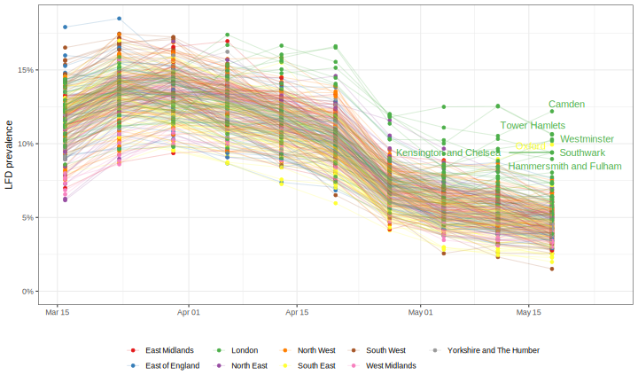
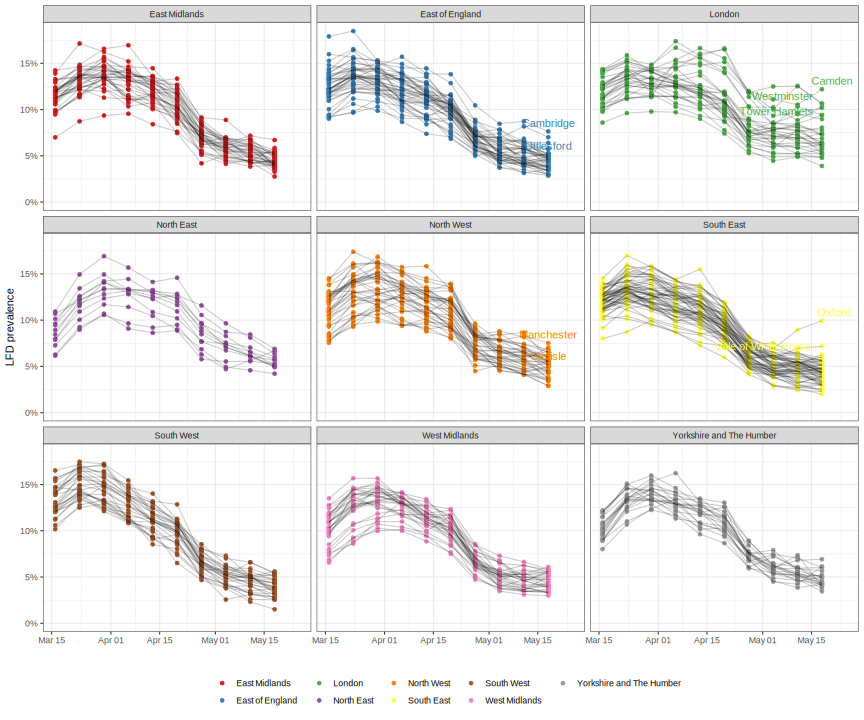

<!-- README.md is generated from README.Rmd. Please edit that file -->

```{r, echo = FALSE}
knitr::opts_chunk$set(
  collapse = TRUE,
  comment = "#>",
  fig.path = "README-"
)
Title <- "LFD prevalence in England"
```

# LFD prevalence in England

This data visualises the latest LFD positivy data published as part of the [Weekly statistics for NHS Test and Trace](https://www.gov.uk/government/collections/nhs-test-and-trace-statistics-england-weekly-reports).

### Latest LFD positive prevalence at LTLA level






### Latest LFD positive prevalence in educational settings

Approximate periods during which schools were closed are shaded dark.


# LFD mass testing in English schools - additional evidence of high test specificity

This repository also contains the data and code for our note:

Funk S, Flasche S,  _`r Title`_. Available at <https://cmmid.github.io/topics/covid19/mass-testing-schools.html>.

### How to download or install

The code is installed as an R package, `covid19.lfd.education`, from GitHub with:

```{r gh-installation, eval = FALSE}
# install.packages("devtools")
remotes::install_github("sbfnk/covid19.lfd.education")
```

To re-create the results, run the script in `inst/scripts/lfd.r`:

```{r lfd, eval = FALSE}
source(system.file(package = "covid19.lfd.education",
                   file.path("scripts", "lfd.r")))
res
```

To make changes, just create a copy of `lfd.r` locally and edit this:

```{r lfd_copy, eval = FALSE}
file.copy(system.file(package = "covid19.lfd.education",
                      file.path("scripts", "lfd.r"),
                      "my_code_dir/lfd.r"))
```

Documentation for the `estimate_min_specificity` function, which is used to estimate the lower bound of specificity, can be found using `?estimate_min_specificity`.

# Copyright notice

Contains shapefiles from the Office for National Statistics licensed under the Open Government Licence v.3.0. Contains OS data © Crown copyright and database right 2022.
