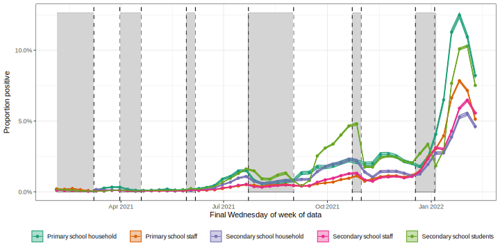

<!-- README.md is generated from README.Rmd. Please edit that file -->

# LFD mass testing in English schools - additional evidence of high test specificity

This repository contains the data and code for our note:

Funk S, Flasche S, *LFD mass testing in English schools - additional
evidence of high test specificity*. Available at
<https://cmmid.github.io/topics/covid19/mass-testing-schools.html>.

### How to download or install

The code is installed as an R package, `covid19.lfd.education`, from
GitHub with:

``` r
# install.packages("devtools")
remotes::install_github("sbfnk/covid19.lfd.education")
```

To re-create the results, run the script in `inst/scripts/lfd.r`:

``` r
source(system.file(package = "covid19.lfd.education",
                   file.path("scripts", "lfd.r")))
res
```

To make changes, just create a copy of `lfd.r` locally and edit this:

``` r
file.copy(system.file(package = "covid19.lfd.education",
                      file.path("scripts", "lfd.r"),
                      "my_code_dir/lfd.r"))
```

Documentation for the `estimate_min_specificity` function, which is used
to estimate the lower bound of specificity, can be found using
`?estimate_min_specificity`.

### Latest LFD positive prevalence

Periods during which schools were closed are shaded dark.


